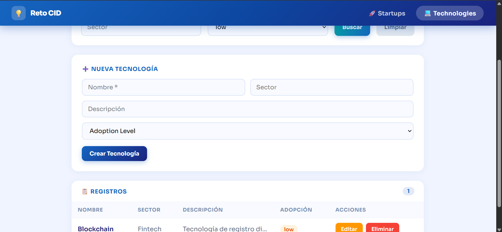
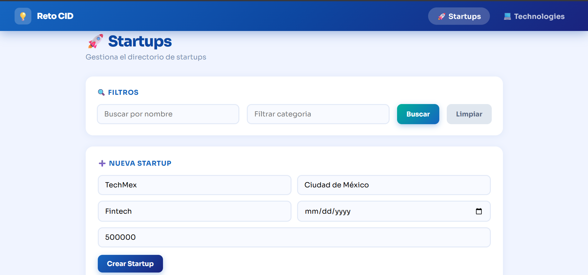
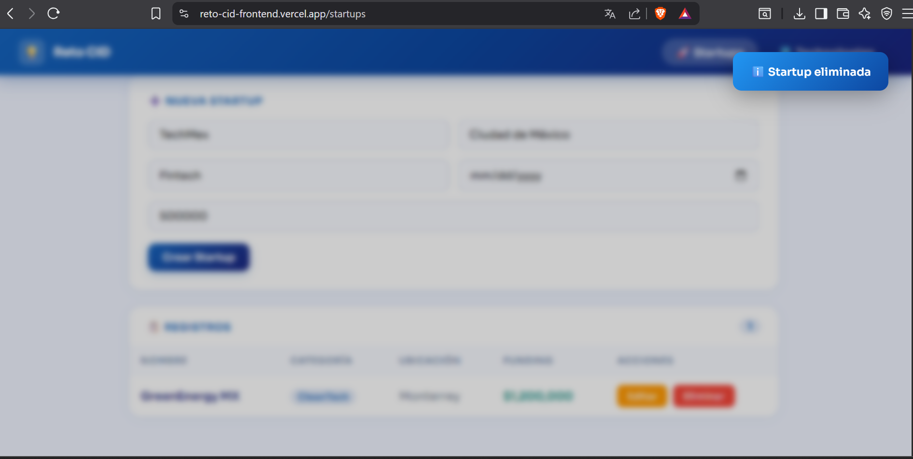
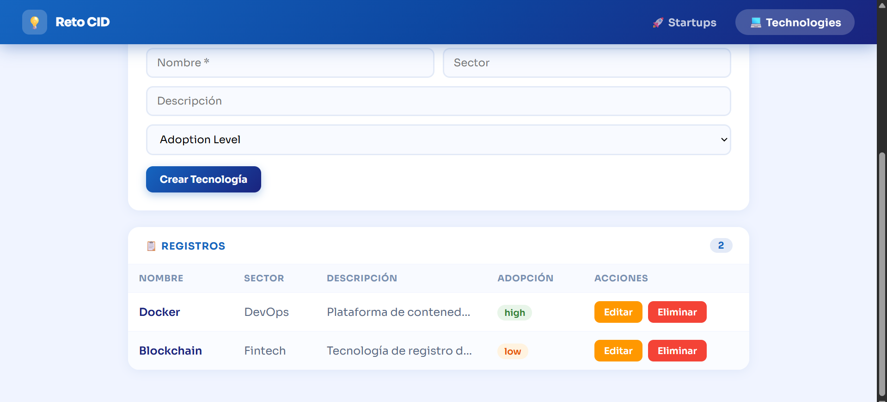
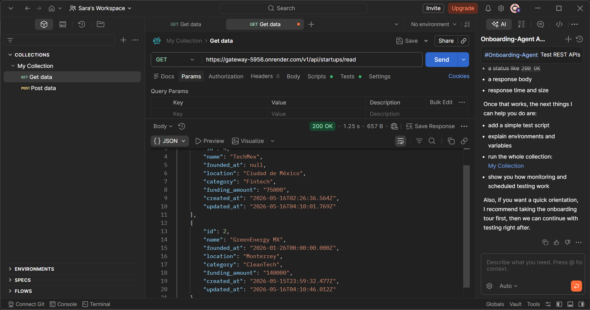
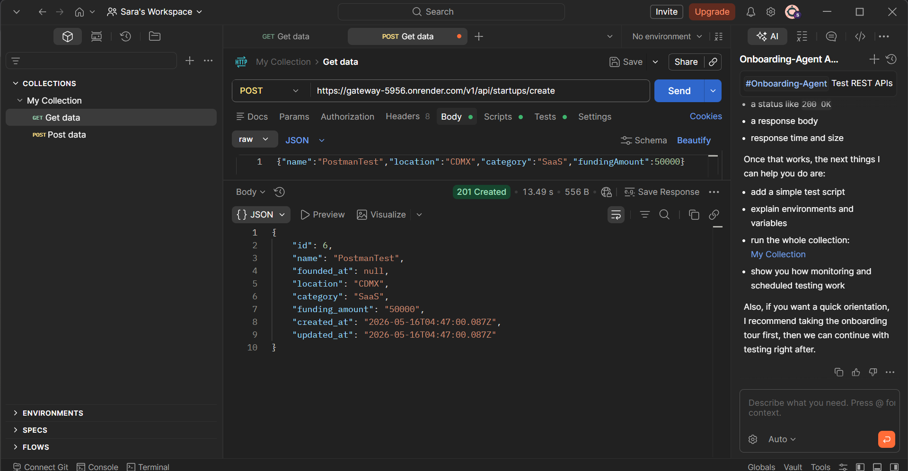
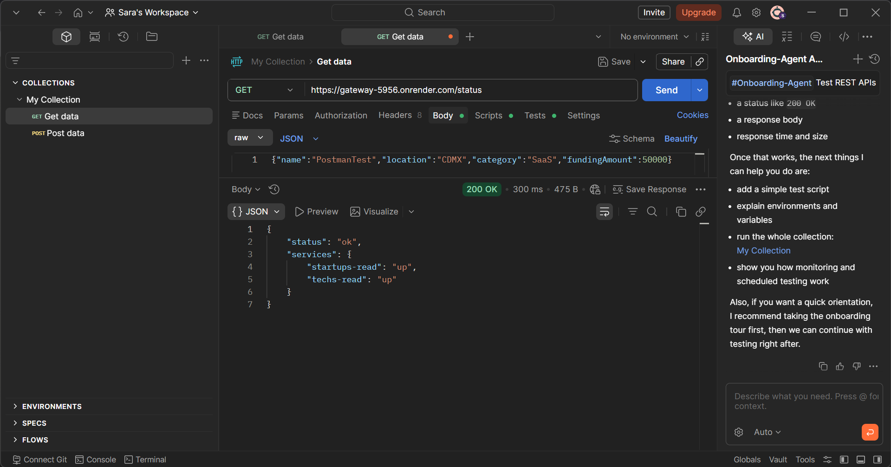

# Reto CID — Microservicios CRUD

Sistema de microservicios desacoplados por acción CRUD, expuestos vía API Gateway Node/Express, con frontend React funcional desplegado en la nube.

---

## Arquitectura

```
+-----------------------------------------------------+
|           CLIENTE (React - Vercel)                  |
|      https://reto-cid-frontend.vercel.app           |
+---------------------+-------------------------------+
                      | HTTP
+---------------------v-------------------------------+
|        API GATEWAY (Node/Express - Render)          |
|         https://gateway-5956.onrender.com           |
|                                                     |
|  /v1/api/startups/create   -->  startups-create     |
|  /v1/api/startups/read     -->  startups-read       |
|  /v1/api/startups/update   -->  startups-update     |
|  /v1/api/startups/delete   -->  startups-delete     |
|  /v1/api/technologies/...  -->  techs-*             |
+--+------+------+------+------+------+------+--------+
   |      |      |      |      |      |      |
  [SC]  [SR]  [SU]  [SD]  [TC]  [TR]  [TU]  [TD]
   |      |      |      |      |      |      |      |
   +------+------+------+------+------+------+------+
                          |
               +----------v----------+
               |  PostgreSQL (Render) |
               |  Tablas: startups,   |
               |         technologies |
               +---------------------+

SC=StartupCreate  SR=StartupRead  SU=StartupUpdate  SD=StartupDelete
TC=TechCreate     TR=TechRead     TU=TechUpdate     TD=TechDelete
```

---

## URLs en Producción

| Componente | URL |
|-----------|-----|
| Frontend | https://reto-cid-frontend.vercel.app |
| Gateway | https://gateway-5956.onrender.com |
| startups-create | https://startups-create.onrender.com |
| startups-read | https://startups-read.onrender.com |
| startups-update | https://startups-update.onrender.com |
| startups-delete | https://startups-delete.onrender.com |
| techs-create | https://techs-create.onrender.com |
| techs-read | https://techs-read.onrender.com |
| techs-update | https://techs-update.onrender.com |
| techs-delete | https://techs-delete.onrender.com |

---

## Estructura del Repositorio

```
reto1/
├── gateway/
│   ├── index.js          # API Gateway (Node/Express + axios)
│   ├── nginx.conf        # Configuración Nginx (referencia)
│   ├── Dockerfile
│   └── package.json
├── services/
│   ├── startups/
│   │   ├── create/       # POST /
│   │   ├── read/         # GET / y GET /:id
│   │   ├── update/       # PUT /:id
│   │   └── delete/       # DELETE /:id
│   └── technologies/
│       ├── create/
│       ├── read/
│       ├── update/
│       └── delete/
├── frontend/             # React + Vite
│   └── src/
│       ├── App.jsx
│       ├── api.js
│       └── pages/
│           ├── Startups.jsx
│           └── Technologies.jsx
├── db/
│   └── init.sql          # Creación de tablas
├── docker-compose.yml
├── .env.example
└── README.md
```

---

## Requisitos

- [Docker Desktop](https://www.docker.com/products/docker-desktop/) v24+
- [Node.js](https://nodejs.org/) v18+
- [Git](https://git-scm.com/)

---

## Variables de Entorno

Copia `.env.example` a `.env` y configura los valores:

```bash
cp .env.example .env
```

### `.env.example`

```env
# Base de datos
POSTGRES_USER=admin
POSTGRES_PASSWORD=secret123
POSTGRES_DB=retodb
DATABASE_URL=postgresql://admin:secret123@db:5432/retodb

# Puertos internos de microservicios
CREATE_STARTUP_PORT=3001
READ_STARTUP_PORT=3002
UPDATE_STARTUP_PORT=3003
DELETE_STARTUP_PORT=3004
CREATE_TECH_PORT=3005
READ_TECH_PORT=3006
UPDATE_TECH_PORT=3007
DELETE_TECH_PORT=3008

# Frontend
VITE_API_BASE_URL=http://localhost/v1/api
```

---

## Cómo Correr Localmente

```bash
# 1. Clona el repositorio
git clone https://github.com/Sara101023/Reto-CID.git
cd Reto-CID/reto1

# 2. Copia las variables de entorno
cp .env.example .env

# 3. Levanta todos los servicios
docker compose up --build
```

Una vez levantado:

| Servicio | URL local |
|---------|-----------|
| Frontend | http://localhost |
| Gateway | http://localhost/v1/api |
| PostgreSQL | localhost:5432 |

---

## Cómo Desplegar (orden recomendado)

1. Crear PostgreSQL en Render y ejecutar `db/init.sql`
2. Desplegar los 8 microservicios en Render (root directory por cada servicio)
3. Desplegar el gateway en Render con las URLs de los microservicios como variables de entorno
4. Desplegar el frontend en Vercel con `VITE_API_BASE_URL` apuntando al gateway

---

## Rutas de API

### Startups

| Método | Endpoint | Descripción |
|--------|----------|-------------|
| POST | `/v1/api/startups/create` | Crear startup |
| GET | `/v1/api/startups/read` | Listar (filtros opcionales: `?name=&category=`) |
| GET | `/v1/api/startups/read/:id` | Detalle por ID |
| PUT | `/v1/api/startups/update/:id` | Actualizar campos permitidos |
| DELETE | `/v1/api/startups/delete/:id` | Eliminar por ID |

**Body crear/actualizar:**
```json
{
  "name": "TechMex",
  "foundedAt": "2021-03-15",
  "location": "Ciudad de México",
  "category": "Fintech",
  "fundingAmount": 500000
}
```

### Technologies

| Método | Endpoint | Descripción |
|--------|----------|-------------|
| POST | `/v1/api/technologies/create` | Crear tecnología |
| GET | `/v1/api/technologies/read` | Listar (filtros opcionales: `?sector=&adoptionLevel=`) |
| GET | `/v1/api/technologies/read/:id` | Detalle por ID |
| PUT | `/v1/api/technologies/update/:id` | Actualizar campos permitidos |
| DELETE | `/v1/api/technologies/delete/:id` | Eliminar por ID |

**Body crear/actualizar:**
```json
{
  "name": "Docker",
  "sector": "DevOps",
  "description": "Plataforma de contenedores",
  "adoptionLevel": "high"
}
```

---

## Pruebas Manuales

> Nota: los servicios en Render plan gratuito pueden tardar hasta 60 segundos en responder la primera petición tras un periodo de inactividad.

### Startups

```bash
# 1. Crear startup válida
curl -X POST https://gateway-5956.onrender.com/v1/api/startups/create \
  -H "Content-Type: application/json" \
  -d '{"name":"TestCurl","foundedAt":"2022-01-01","location":"Monterrey","category":"SaaS","fundingAmount":100000}'

# Respuesta esperada (201 Created):
# {"id":5,"name":"TestCurl","founded_at":"2022-01-01T00:00:00.000Z","location":"Monterrey","category":"SaaS","funding_amount":"100000",...}

# 2. Crear startup inválida (sin nombre)
curl -X POST https://gateway-5956.onrender.com/v1/api/startups/create \
  -H "Content-Type: application/json" \
  -d '{"location":"CDMX"}'

# Respuesta esperada (400 Bad Request):
# {"message":"El campo name es requerido"}

# 3. Listar todas
curl https://gateway-5956.onrender.com/v1/api/startups/read

# Respuesta esperada (200 OK):
# [{"id":2,"name":"GreenEnergy MX",...},{"id":4,"name":"TechMex",...}]

# 4. Filtrar por categoría
curl "https://gateway-5956.onrender.com/v1/api/startups/read?category=Fintech"

# Respuesta esperada (200 OK):
# [{"id":4,"name":"TechMex","category":"Fintech",...}]

# 5. Leer por ID correcto
curl https://gateway-5956.onrender.com/v1/api/startups/read/4

# Respuesta esperada (200 OK):
# {"id":4,"name":"TechMex",...}

# 6. Leer por ID incorrecto
curl https://gateway-5956.onrender.com/v1/api/startups/read/9999

# Respuesta esperada (404 Not Found):
# {"message":"No encontrado"}

# 7. Actualizar campos permitidos
curl -X PUT https://gateway-5956.onrender.com/v1/api/startups/update/4 \
  -H "Content-Type: application/json" \
  -d '{"fundingAmount":750000}'

# Respuesta esperada (200 OK):
# {"id":4,"name":"TechMex","funding_amount":"750000",...}

# 8. Eliminar existente
curl -X DELETE https://gateway-5956.onrender.com/v1/api/startups/delete/5

# Respuesta esperada: 204 No Content (sin cuerpo)

# 9. Eliminar inexistente
curl -X DELETE https://gateway-5956.onrender.com/v1/api/startups/delete/9999

# Respuesta esperada (404 Not Found):
# {"message":"No encontrado"}
```

### Technologies

```bash
# 1. Crear tecnología válida
curl -X POST https://gateway-5956.onrender.com/v1/api/technologies/create \
  -H "Content-Type: application/json" \
  -d '{"name":"Docker","sector":"DevOps","description":"Plataforma de contenedores","adoptionLevel":"high"}'

# Respuesta esperada (201 Created):
# {"id":2,"name":"Docker","sector":"DevOps","adoption_level":"high",...}

# 2. Crear tecnología inválida
curl -X POST https://gateway-5956.onrender.com/v1/api/technologies/create \
  -H "Content-Type: application/json" \
  -d '{"sector":"DevOps"}'

# Respuesta esperada (400 Bad Request):
# {"message":"El campo name es requerido"}

# 3. Listar todas
curl https://gateway-5956.onrender.com/v1/api/technologies/read

# Respuesta esperada (200 OK):
# [{"id":2,"name":"Docker",...},{"id":3,"name":"Blockchain",...}]

# 4. Filtrar por sector
curl "https://gateway-5956.onrender.com/v1/api/technologies/read?sector=DevOps"

# Respuesta esperada (200 OK):
# [{"id":2,"name":"Docker","sector":"DevOps",...}]

# 5. Filtrar por adoption level
curl "https://gateway-5956.onrender.com/v1/api/technologies/read?adoptionLevel=high"

# Respuesta esperada (200 OK):
# [{"id":2,"name":"Docker","adoption_level":"high",...}]

# 6. Leer por ID correcto
curl https://gateway-5956.onrender.com/v1/api/technologies/read/2

# Respuesta esperada (200 OK):
# {"id":2,"name":"Docker",...}

# 7. Leer por ID incorrecto
curl https://gateway-5956.onrender.com/v1/api/technologies/read/9999

# Respuesta esperada (404 Not Found):
# {"message":"No encontrado"}

# 8. Actualizar
curl -X PUT https://gateway-5956.onrender.com/v1/api/technologies/update/2 \
  -H "Content-Type: application/json" \
  -d '{"adoptionLevel":"medium"}'

# Respuesta esperada (200 OK):
# {"id":2,"name":"Docker","adoption_level":"medium",...}

# 9. Eliminar existente
curl -X DELETE https://gateway-5956.onrender.com/v1/api/technologies/delete/4

# Respuesta esperada: 204 No Content (sin cuerpo)
```

### Health Checks

```bash
curl https://gateway-5956.onrender.com/health
# {"status":"ok"}

curl https://gateway-5956.onrender.com/status
# {"status":"ok","services":{"startups-read":"up","techs-read":"up"}}

curl https://startups-read.onrender.com/health
# {"status":"ok"}
```

---

## Capturas de Pantalla

### Lista de startups con registros


### Búsqueda con filtros


### Formulario de creación


### Startup eliminada


### Technologies


### Postman - GET /v1/api/startups/read


### Postman - POST /v1/api/startups/create (201 Created)


### Postman - GET /status (servicios activos)


---

## Stack Tecnológico

| Capa | Tecnología |
|------|-----------|
| Frontend | React 18 + Vite + React Router |
| Gateway | Node.js + Express + Axios |
| Microservicios | Node.js + Express + pg |
| Base de datos | PostgreSQL 15 |
| Contenedores | Docker + Docker Compose |
| Deploy Frontend | Vercel |
| Deploy Backend | Render |


---

## Limitaciones Conocidas

- **Cold starts:** Los servicios en Render plan gratuito se duermen tras 15 minutos de inactividad. La primera petición puede tardar entre 30 y 60 segundos. El frontend muestra un modal de aviso al primer acceso.
- **Sin autenticación:** El reto no requiere JWT; los endpoints son públicos.
- **Seed manual:** No existe un script automático de datos iniciales. Para poblar la base de datos se deben usar los endpoints de creación o ejecutar `db/init.sql` directamente en pgAdmin.
- **Botón "Limpiar" requiere doble clic:** Por la naturaleza asíncrona del estado en React, el botón Limpiar del filtro necesita dos clics para resetear completamente los resultados. Solución futura: refactorizar con `useCallback` o `useRef`.
- **Gateway Node/Express en lugar de Nginx puro:** El reto sugería Nginx como gateway. Se optó por Node/Express para facilitar el despliegue en Render y manejar timeouts de cold starts. El archivo `nginx.conf` está incluido como referencia.

---

## A futuro

- Agregar autenticación JWT en el gateway
- Implementar rate limiting por IP
- Agregar tests automatizados con Jest
- Migrar a plan pago en Render para eliminar los cold starts
